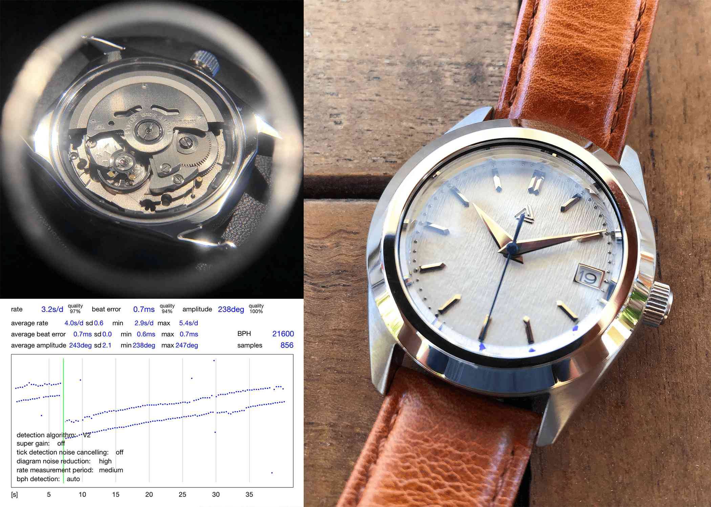

## Overview:
These watches draw inspiration from the Grand Seiko Snowlake, models SBGA211G and SBGX355. They are built upon the heavily modular and customizable bodies of the SKX-011 and 013. The movement is an upgraded NH36. The sheet below is for the SXK-011 build, and the image is from the SKX-013.

## Links:
- [Excel Sheet](https://docs.google.com/spreadsheets/d/15JeqJ5BWEtnyB5cyLyxu_Sx80FZJaI6cgg1Tmqi0ySs/edit?usp=sharing)

