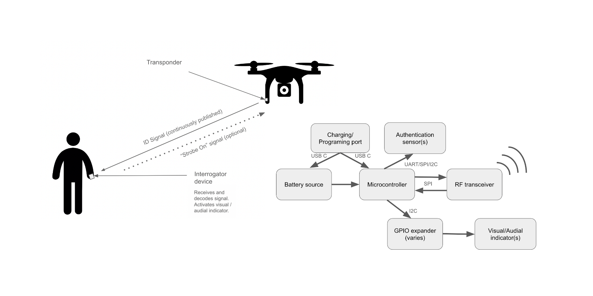
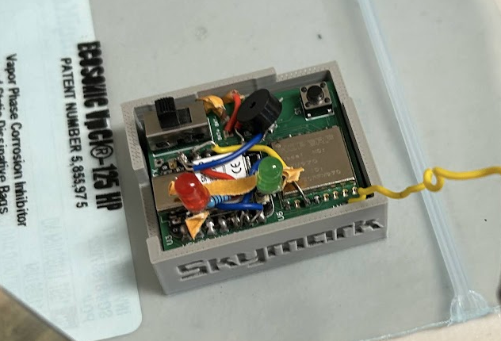

## Overview:
This is an ongoing project being led by Matan Kedar and Oleksandr Gorpynich. Funded by Cal Poly San Louis Obispo's Summer Accelerator, the goal is to create a device 

## Problem: 
The increasing use of small, autonomous, remotely controlled drones in combat scenarios poses significant challenges for ground operators, who often struggle to differentiate between friendly and enemy units. The current identification process for these small drones is convoluted, and there are no set procedures in place. As the drones are small, fast, and all look similar (if not identical) across the battlefield, operators default to either hesitation and failing to act, or assume the worst, resulting in potential casualties or wasted resources.

## High-Level Solution: 
A compact "Identification Friend or Foe" (IFF) system consisting of two key components: a versatile transponder that can be externally mounted on any drone and a portable handheld interrogator for use by operators on the ground. This IFF system enables operators to rapidly and accurately identify friendly units, providing immediate visual confirmation in the field. By enhancing situational awareness and reducing uncertainty, it minimizes the risk of friendly fire and conserves critical resources in dynamic combat environments. Signal encryption is built into the solution in case a malicious actor gains control of an interrogator or transponder.  
[Github Gist security explanation](https://gist.github.com/OlexG/c53dc7537675c6cb3aac6dd665c71c90)

When a user hears a drone overhead, a single button press instantly verifies whether the drone is friendly.  
[Demo video of prototype](https://tinyurl.com/yy5fafyh)

---

