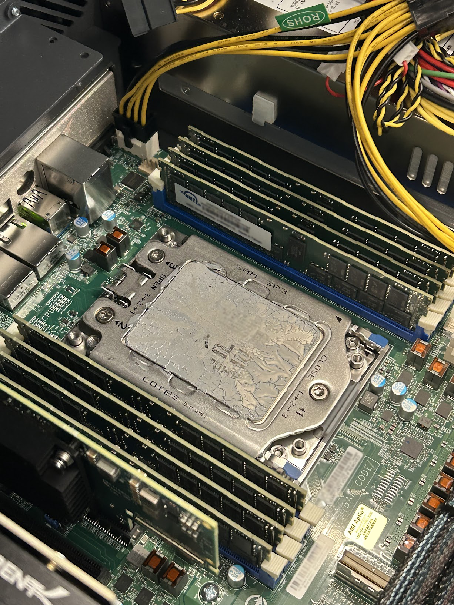
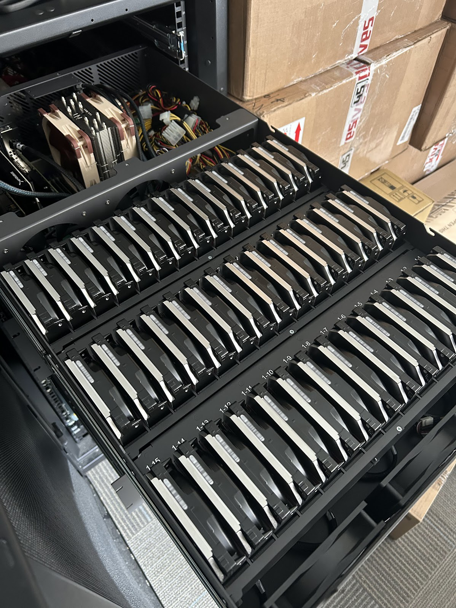

## Overview:
This is a current & ongoing project with the intent of resolving NYU's dependency issues on Google Cloud Storage.

## Goal: 
Deploy an initial 10 PetaBytes (10,000 TerraBytes | 62,500 Kindle 11th Gen. readers) of redundant storage over the HSRN's network infrastructure, accessible to researches & faculty throughout the campus's buildings, while keeping the solution cost-efficient.

## Considerations:
We do not want to have to worry about leaks or maintenance. But we still need keep fan noise low because noise is bad for the drives' performance. 

## Current Individual Machine Specs:
- Chassis: 45Drives Storinator S45
- Mass Storage: Western Digital 0F38652 (45x20TB)
- Boot Drive(s): Generic Sata SSDs (2x512GB)
- CPU: AMD EPYC 7443P
- Motherboard: Supermicro H12SSL-i
- Heat sink: Noctua NH-U9 TR4-SP3
- RAM: NEMIX DDR4 3200MHZ (8x64GB)
- Network Card: NVIDIA Mellanox MCX653106A-ECAT ConnectX-6
- Controller: Broadcom 9305-16i

## Key Features
- **Ceph**: All of the machines in the cluster use Ceph to ensure data is both redundant and distributed across the network. This keeps the availability and fault tolerance high.
- **Automatic Benchmarking**: We are writing custom scripts that integrate with benchmarking software to efficiently test components before the machines reach production.
- **Cluster Monitoring**: The entire cluster is being monitored with Prometheus Node Exporter and Grafana, providing real-time insights into the systems' activities, health and performance.
- **Boot Drive Redundancy**: Each machine has two SATA SSDs configured in RAID 1 running Ubuntu Server 22.

## Future Outlook
After 10PB are deployed, NYU may be looking to expand into the 50PB range.

---

