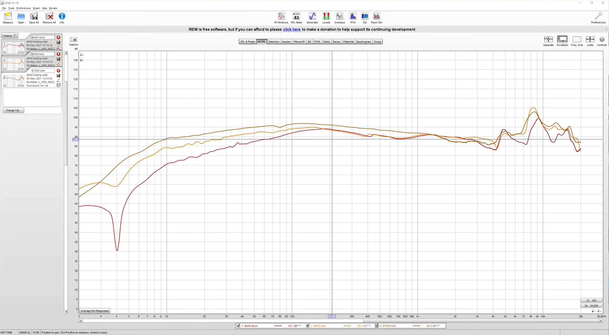

## Overview:
By removing the inner plastic shell, placing in foam padding and strips of adhesive-backed lead, I tuned my Beyerdynamic DT990 Pro headphones. After the modification, I was able to smooth out the frequency response in the highs between 3k and 5k Hz, while making the base stronger and tighter. Below are the results of the mass loading and damping.

---

Red line is the frequency response prior to the modification, yellow is after adding lead, brown is after adding the foam.