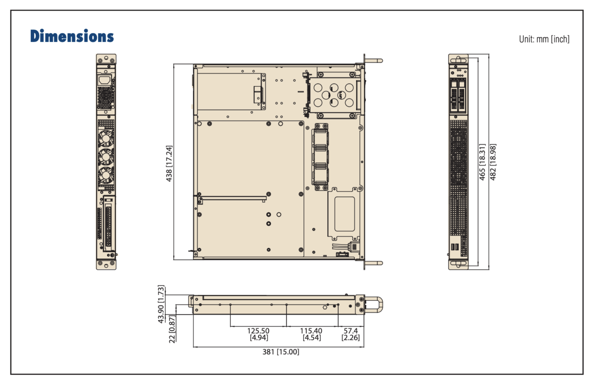

## Overview: 
This project is being funded by a DURF grant from NYU. A Zeek Node is a machine that sits on the network, between two devices. It's purpose is to monitor traffic, reflecting packets and analyzing them in real time.

## Considerations:
The machine should be designed to perform post-event traffic analysis. It reflects network traffic to analyze packets after they have been sent and received. This is to ensure performance is unaffected by the monitoring, while still identifying suspicious activity. It must fit in 1U worth of rack space. And finally, it has to be able to run Zeek at 100 Gigabit/second.

## Approach:
1. **Build the Zeek machine**  
2. **Validate the two machines**  
   - Ensure the machines can output enough network traffic.  
   - Create artificial traffic using [TRex](https://trex-tgn.cisco.com/).  
   - Monitor the systems using Prometheus Node Exporter & Grafana.  
3. **Begin Zeek packet sniffing**  
   - Configure Zeek to analyze the network traffic between the two aforementioned machines.  
   - Monitor the Zeek logs using Prometheus Node Exporter & Grafana.  
4. **Document results**  
5. **Present results**

## Final Comments:
This page will be updated once the project is complete.

---

