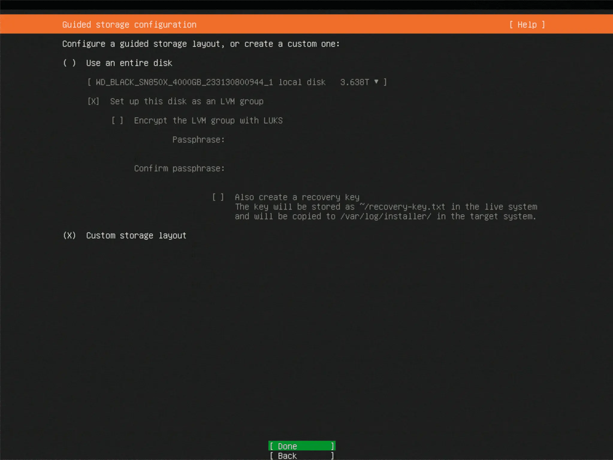
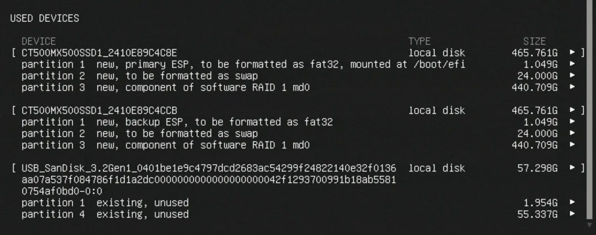

_HSRN wiki page written by me, Fall 2024._

# Creating Software Raid for Redundant Boot

_The version of Ubuntu used in this install guide is Ubuntu Server 22._

1. Begin with the usual installation of the operating system.  
2. When you reach the stage that is “Guided Storage Configuration”, select “Custom Storage Layout” and hit “Done”.  
{width=1023 height=768}  
3. On the “Storage Configuration” page, reset all settings. Then delete any drives that are currently being used as boot drives except for what is most likely your USB or alternative mounting drive.  
It should look similar to the image below:  
{width=1022 height=766}  
4. Select both SSDs and add them as boot devices.
5. Create partitions on the desired boot drives by clicking *Add GPT Partition* on the free storage row beneath the drive name: In our testing we used two 500GB drives.  
&nbsp;&nbsp;&nbsp;&nbsp;1 partition should be for the swap partition (it’s size approximate to the square root of the desired boot drive size). In our testing I made this 24GB. Format it as Swap.  
&nbsp;&nbsp;&nbsp;&nbsp;1 partition should be the boot partition. I chose to make it the rest available storage. You can do so by leaving the size selection as empty. Leave it unformatted.  
Do that for both drives. It should look like this:  
{width=1023 height=768}  
6. Then, go down and select “Create software RAID (md)”.
{width=276 height=63}  
7. Create RAID “md0” with RAID Level 1 (mirrored) by going down the list and selecting all partitions.  
*In our scenario, the drive names and details were not visible within the selection raid creation menu and  only the location of cursor was available. In this situation, hit the Space key once for every Down-arrow key press as to select all partitions and drives. If you can see the partitions, just select the required ones.*
{width=1022 height=765}  
8. Back in the main storage configuration screen, go to each drive that is **not** supposed to be in the raid and remove it. For this configuration, we want to add the boot drives. So remove all drives from md0 except the two unformatted partitions we will be installing our operating system on.  
{width=827 height=326}  
9. Now, go and create a GPT Partition on md0's free space, located under AVAILABLE DEVICES.  
{width=945 height=196}  
Leave everything default.  
{width=642 height=271}
10. Finally, your USED DEVICES should look like this (or quite similar):  
{width=832 height=378}  
Select Done and continue with your normal install process:
{width=142 height=65}  
{width=642 height=261}
