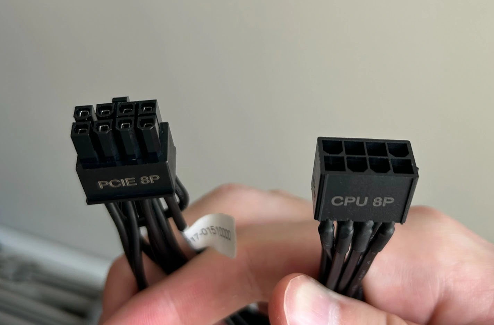
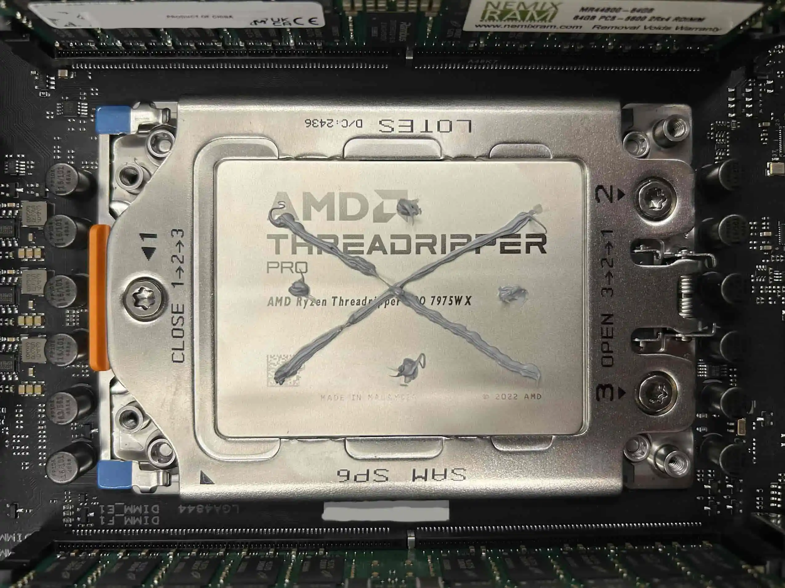
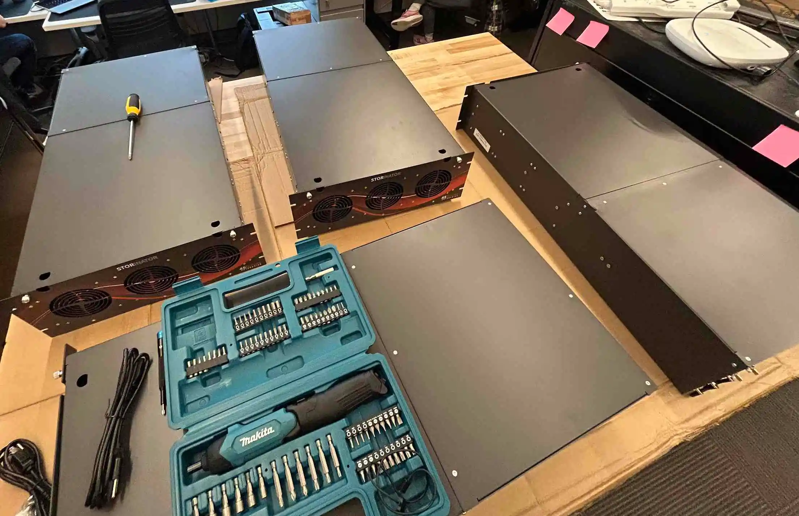

### Motivation

To create four machines so over-specked that we can underclock them. That way, we can determine the most optimized cost/performance setups for application specific machines, such as Zeek nodes and Ceph [JBOD boxes](https://www.seagate.com/blog/what-is-jbod/). Below is what I did.

### Per machine components

| Component         | Description                                                                                                                                                          | Quantity     |
|------------------|----------------------------------------------------------------------------------------------------------------------------------------------------------------------|--------------|
| CPU              | [AMD Ryzen™ Threadripper™ PRO 7975WX](https://www.bhphotovideo.com/c/product/1791038-REG/amd_100_100000453wof_ryzen_threadripper_pro_7975wx.html)                   | 1            |
| Motherboard      | [ASUS Pro WS WRX90E-SAGE SE](https://www.amazon.com/Pro-WRX90E-SAGE-Workstation-Motherboard-ThreadripperTM/dp/B0CQRYXWWQ)                                          | 1            |
| RAM              | [Nemix 512 8 * 64](https://www.amazon.com/NEMIX-RAM-Registered-Compatible-Motherboard/dp/B0DQYTHNN2)                                                               | 1            |
| Cooler           | [Arctic Freezer 4U-M (Rev. 2)](https://www.amazon.com/ARCTIC-Freezer-4U-M-Rev-2/dp/B09VGTZSDY)                                                                      | 1            |
| Chassis          | [45 Drives EEB](https://www.45drives.com/products/storinator-s45-configurations.php)                                                                               | 1            |
| PSU              | [1400W MTW2-5AD0B2V (RoHS)](https://www.zippy.com/en/04_power_pro_page.aspx?Model_Name=MTW2-5AD0B2V)                                                                | 1 (included) |
| SSD Boot Drive   | [SAMSUNG 870 EVO 2TB @ 6Gb/s](https://www.amazon.com/dp/B08QB93S6R)                                                                                                  | 2            |
| M.2s             | [Samsung 4TB 9100 PRO PCIe 5.0 M.2](https://www.amazon.com/SAMSUNG-Computing-Workstations-VAP4T0B-AM/dp/B0DX2GJ1YR)                                                  | 12           |
| HDDs             | [WD 24TB](https://www.amazon.com/Western-Digital-24TB-Internal-Drive/dp/B0D24TQK3Q)                                                                                 | 45 + 4       |
| Network Card     | [Mellanox MCX653106A-ECAT ConnectX-6](https://www.fs.com/products/168436.html?now_cid=4014)                                                                         | 1            |
| M.2 Adapter      | [AORUS Gen5 AIC Adapter](https://www.amazon.com/GIGABYTE-AORUS-Click-Adapter-GC-4XM2G5/dp/B0CXZK5JGC)                                                               | 2            |
| Controller       | [LSI 9305-16i](https://www.amazon.com/LSI-Controller-05-25703-00-9305-16i-PCI-Express/dp/B01BDZWJAO)                                                                | 3            |

### Per machine setup process

1. Build the machine.
	1. Ensure motherboard is placed atop anti-static bag.
	2. Install the CPU.
	3. Install the RAM.
	4. Install the NVME SSDs.
		- There will be four of them on the motherboard.
	5. Install the motherboard standoffs in the chassis.
		- These came with the chassis.
		- Only 10 are be required.
	6. Lower the motherboard into the chassis.
		- *The ASUS Pro WS WRX90E-SAGE SE is heavy and the chrome fan grills are very sharp. Make care not to cut yourself, especially when lowering the motherboard into the chassis.* - ⚠️
	7. Install the motherboard screws.
		- These came with the motherboard.
		- Only 10 are required.
	8. Install the cooler.
		- Apply thermal paste to CPU.
		- Ensure it is facing the correct direction.
		- Connect the two fans to motherboard headers `CPU_FAN1` and `CPU_FAN2`.
	9. Plug the PSU cables into the motherboard.
		- 24 pin plug goes to the 24 port.
		- The two red 8 pin plugs go to `PCIE_CPU_12V_1` and `PCIE_CPU_12V_2`.
		- Due to the amount of PCIE slots we are using, we need to dedicate power to `PCIE_8P(2)_PWR`.
		- I am using an adapter to use a CPU power cable. This adapter came with the motherboard. 
			
	10. Connect the two chassis fans to their fan headers.
		- Plug them into `CHA_FAN` and `CHA_FAN2` respectively.
	11. Connect the power button.
		- Cables go to the `F_PANEL` pins.
	12. Install the SATA SSDs.
		1. Connect them to power. (15-Pin SATA Power from the PSU)
		2. Connect them to data. (SATA6G_1 & SATA6G_2 on the motherboard)
	13. Setup the two NVME Expansion cards.
		1. Unscrew the back-plate & take it off.
		2. Take off the front-plate.
		3. Peel off clear covering for the thermal pads which the NVMEs sit on.
		4. Install the 4 NVME drives.
		5. Peel off clear covering for the large thermal pad that sits ontop of the NVMEs.
		6. Replace the front-plate.
		7. Replace the back-plate and screw it back into place.
	14. Install the cards
		- Here is PCIE slot configuration for the cards.
			- Slot 1 (has PCIe 5.0 x16): AORUS Gen5 AIC Adapter (needs PCIe 5.0 x16)
			- Slot 2 (has PCIe 5.0 x16): LSI 9305-16i Drive Controller (needs PCIe 3.0 x16)
			- Slot 3 (has PCIe 5.0 x16): AORUS Gen5 AIC Adapter (needs PCIe 5.0 x16)
			- Slot 4 (has PCIe 5.0 x16): LSI 9305-16i Drive Controller (needs PCIe 3.0 x16)
			- Slot 5 (has PCIe 5.0 x16): *Empty*
			- Slot 6 (has PCIe 5.0 x8): LSI 9305-16i Drive Controller (needs PCIe 3.0 x16) - ⚠️
			- Slot 7 (has PCIe 5.0 x16): Mellanox ConnectX-6 Network Card (needs PCIe 5.0 x16)
		- The second AORUS Gen5 AIC Adapter has been placed in Slot 3, because if it were in Slot 2, it would suffocate the first AORUS Gen5 AIC Adapter, which has a downwards facing fan.
		2. Place each card into its respective PCIE slot.
			- It is easier to plug the drive controller cables into the card before placing the card into the PCIE slot.
				1. Plug drive controller cables in. Cable A4 is closest to the board, and A1 is closest to the roof of the chassis.
				2. Repeat for the other LSI controllers with cables B1-4 and C1-4.
2. Flash the BIOS.
	1. [Download necessary files](https://www.asus.com/us/motherboards-components/motherboards/workstation/pro-ws-wrx90e-sage-se/helpdesk_bios?model2Name=Pro-WS-WRX90E-SAGE-SE). 
		- I downloaded version `2.22.1290`.
	2. Rename the .CAP file.
		- Unzip the .zip.
		- If on a Windows machine, execute BIOSRenamer.exe.
		- If on other, rename the .CAP file to `A5496.CAP`.
	3. Drag and drop `A5496.CAP` onto a freshly formatted USB. Ensure it is the only file on the USB.
	4. Plug the USB into the rear I/O's BIOS FlashBack USB-A port.
	5. Hold down the BIOS FlashBack button beneath the port for ~3 seconds until its BIOS FlashBack LED flashes 3 times. The light will be green.
	6. It will then continue to flash until the update is complete. When complete, the light will turn off.
3. Enable bifurcation within the BIOS.
	1. Enter bios.
	2. Navigate to bifurcation settings by folloeing this UI path: `Advanced > Onboard Devices Configuration`.
	3. Set slots `PCIEX16(G5)_1` and `PCIEX16(G5)_3` to `PCIE RAID MODE`.
	4. Save and exit the BIOS.
4. Install the OS.
	1. Download the ISO file (I opted for [Ubuntu Server 22](https://releases.ubuntu.com/jammy/)).
	2. Flash it to a USB using a tool such as [Belena Etcher](https://etcher.balena.io/).
	3. Ensure the machine is powered off, and plug the USB into the rear I/O.
	4. Turn on the machine and wait for it to reach the Install Screen.
		1. Configure as per normal up until drives section.
		2. Select the option to create custom storage configuration.
		3. [Confifure RAID 1](RAID1/INSTALL_RAID1_GUIDE.md) on the two SAMSUNG 870 EVO 2TB drives.
		4. Install OpenSSH
		5. Complete install.

### Future

Next steps are to further configure and benchmark the machines, testing to make sure they operating as expected.

### Notes

Although it is not advertized, 45Drives __will__ make EEB chassis on request. The cost was an additional $215 per unit.

### Technical Resources Referenced

https://dlcdnets.asus.com/pub/ASUS/mb/SocketsTR5/Pro_WS_WRX90E-SAGE_SE/E25489_Pro_WS_WRX90E-SAGE_SE_EM_V3_WEB.pdf?model=Pro%20WS%20WRX90E-SAGE%20SE

### Images

